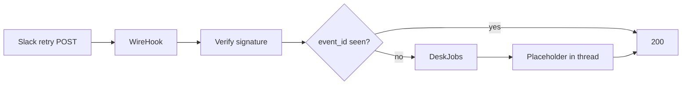

# hook

```mermaid
flowchart LR
  wire[Slack retry POST] --> hook[WireHook]
  hook --> ver[Verify signature]
  ver --> dedup{event_id seen?}
  dedup -->|yes| ack[200]
  dedup -->|no| q[DeskJobs]
  q --> hold[Placeholder in thread]
  hold --> ack
```
