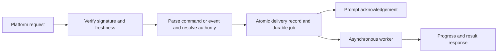

# hook

```mermaid
flowchart LR
  wire[Platform request] --> verify[Verify signature and freshness]
  verify --> normalize[Parse command or event and resolve authority]
  normalize --> tx[Atomic delivery record and durable job]
  tx --> ack[Prompt acknowledgement]
  tx --> worker[Asynchronous worker]
  worker --> reply[Progress and result response]
```
