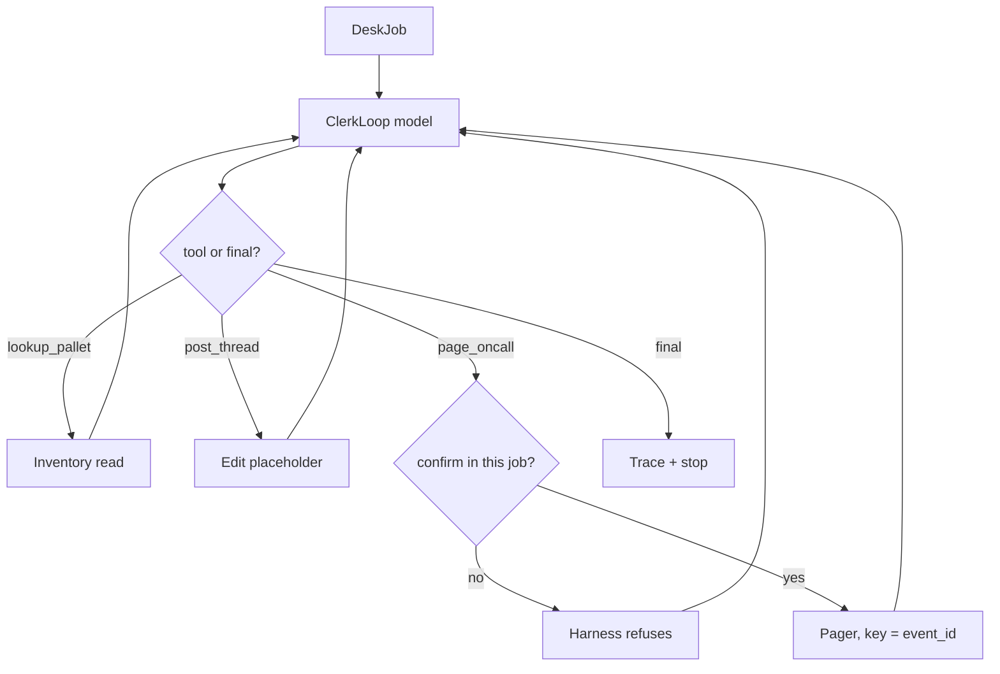

# loop

```mermaid
flowchart TB
  job[DeskJob] --> model[ClerkLoop model]
  model --> tool{tool or final?}
  tool -->|lookup_pallet| inv[Inventory read]
  tool -->|post_thread| post[Edit placeholder]
  tool -->|page_oncall| gate{confirm in this job?}
  gate -->|no| refuse[Harness refuses]
  gate -->|yes| page[Pager, key = event_id]
  inv --> model
  post --> model
  page --> model
  tool -->|final| stop[Trace + stop]
  refuse --> model
```
