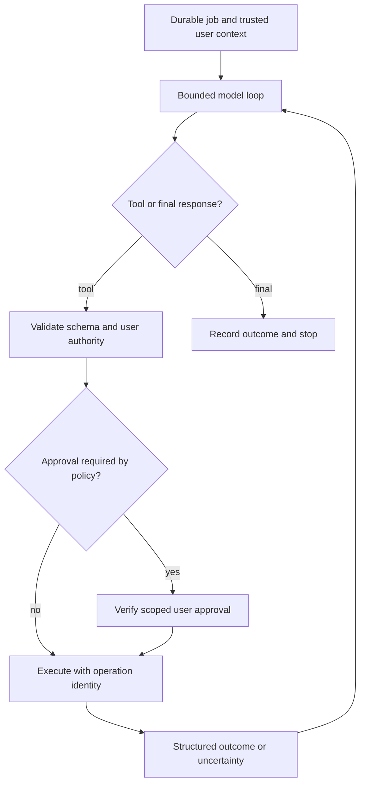

# loop

```mermaid
flowchart TB
  job[Durable job and trusted user context] --> model[Bounded model loop]
  model --> proposal{Tool or final response?}
  proposal -->|tool| auth[Validate schema and user authority]
  auth --> gate{Approval required by policy?}
  gate -->|yes| approve[Verify scoped user approval]
  gate -->|no| execute[Execute with operation identity]
  approve --> execute
  execute --> obs[Structured outcome or uncertainty]
  obs --> model
  proposal -->|final| stop[Record outcome and stop]
```
