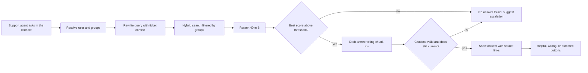

# ask

```mermaid
flowchart LR
  agent[Support agent asks in the console] --> authz[Resolve user and groups]
  authz --> rewrite[Rewrite query with ticket context]
  rewrite --> search[Hybrid search filtered by groups]
  search --> rerank[Rerank 40 to 6]
  rerank --> enough{Best score above threshold?}
  enough -->|no| none[No answer found, suggest escalation]
  enough -->|yes| draft[Draft answer citing chunk ids]
  draft --> verify{Citations valid and docs still current?}
  verify -->|yes| show[Show answer with source links]
  verify -->|no| none
  show --> feedback[Helpful, wrong, or outdated buttons]
```
