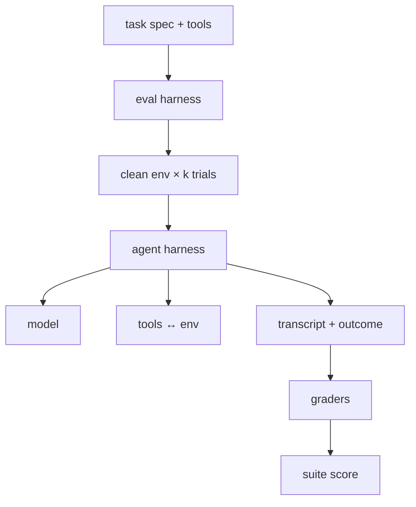

# Eval loop

```mermaid
flowchart TB
  task[task spec + tools] --> evalh[eval harness]
  evalh --> env[clean env × k trials]
  env --> agent[agent harness]
  agent --> model[model]
  agent --> tools[tools ↔ env]
  agent --> out[transcript + outcome]
  out --> grade[graders]
  grade --> score[suite score]
```
