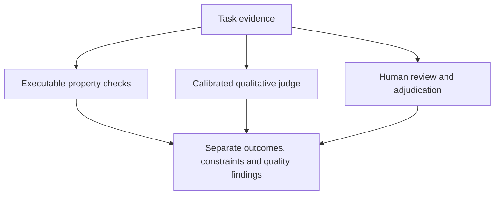

# kinds

```mermaid
flowchart TB
  evidence[Task evidence] --> code[Executable property checks]
  evidence --> model[Calibrated qualitative judge]
  evidence --> human[Human review and adjudication]
  code --> results[Separate outcomes, constraints and quality findings]
  model --> results
  human --> results
```
