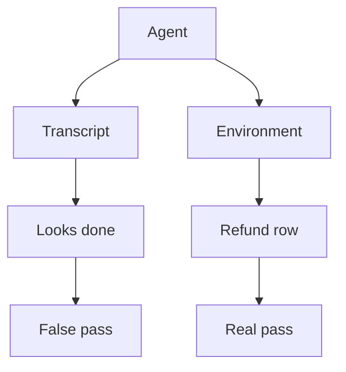

# grade

```mermaid
flowchart TB
  agent[Agent] --> talk[Transcript]
  agent --> world[Environment]
  talk --> maybe[Looks done]
  world --> truth[Refund row]
  maybe --> wrong[False pass]
  truth --> real[Real pass]
```
