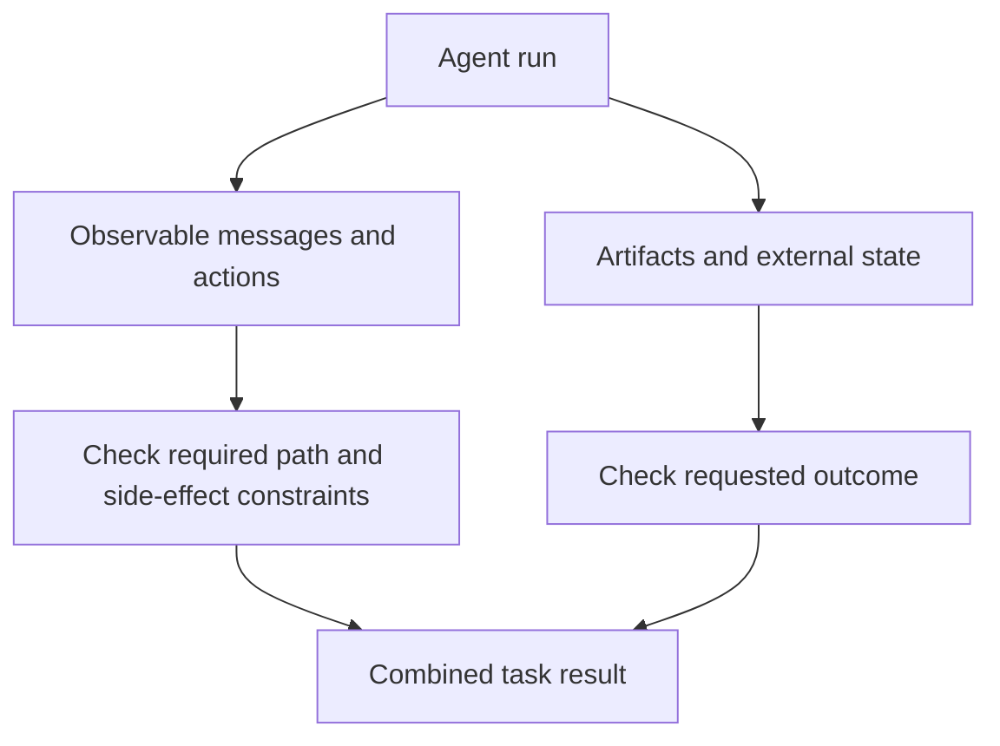

# grade

```mermaid
flowchart TB
  run[Agent run] --> talk[Observable messages and actions]
  run --> world[Artifacts and external state]
  talk --> constraints[Check required path and side-effect constraints]
  world --> outcome[Check requested outcome]
  constraints --> result[Combined task result]
  outcome --> result
```
