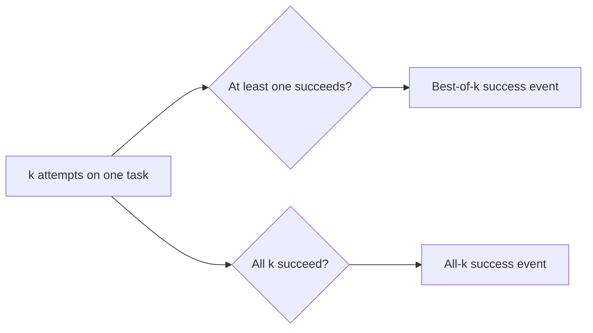

# k

```mermaid
flowchart LR
  trials[k attempts on one task] --> any{At least one succeeds?}
  trials --> all{All k succeed?}
  any --> some[Best-of-k success event]
  all --> every[All-k success event]
```
