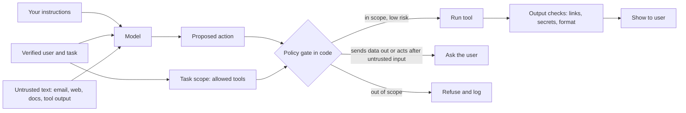

# trust

```mermaid
flowchart LR
  user[Verified user and task] --> scope[Task scope: allowed tools]
  sys[Your instructions] --> model[Model]
  user --> model
  ext[Untrusted text: email, web, docs, tool output] --> model
  model --> proposal[Proposed action]
  proposal --> policy{Policy gate in code}
  scope --> policy
  policy -->|in scope, low risk| tool[Run tool]
  policy -->|sends data out or acts after untrusted input| confirm[Ask the user]
  policy -->|out of scope| deny[Refuse and log]
  tool --> out[Output checks: links, secrets, format]
  out --> show[Show to user]
```
