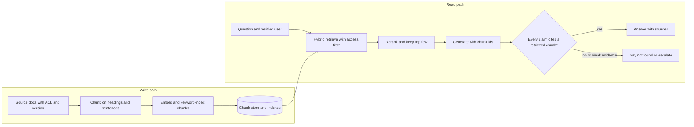

# flow

```mermaid
flowchart LR
  subgraph ingest [Write path]
    src[Source docs with ACL and version] --> split[Chunk on headings and sentences]
    split --> embed[Embed and keyword-index chunks]
    embed --> store[(Chunk store and indexes)]
  end
  subgraph query [Read path]
    ask[Question and verified user] --> fetch[Hybrid retrieve with access filter]
    fetch --> rerank[Rerank and keep top few]
    rerank --> gen[Generate with chunk ids]
    gen --> cite{Every claim cites a retrieved chunk?}
    cite -->|yes| answer[Answer with sources]
    cite -->|no or weak evidence| abstain[Say not found or escalate]
  end
  store --> fetch
```
