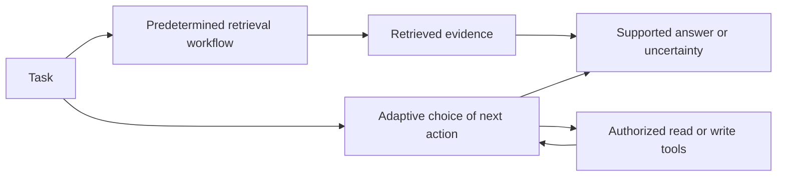

# split

```mermaid
flowchart LR
  q[Task] --> workflow[Predetermined retrieval workflow]
  q --> agent[Adaptive choice of next action]
  workflow --> evidence[Retrieved evidence]
  agent --> tools[Authorized read or write tools]
  tools --> agent
  evidence --> answer[Supported answer or uncertainty]
  agent --> answer
```
