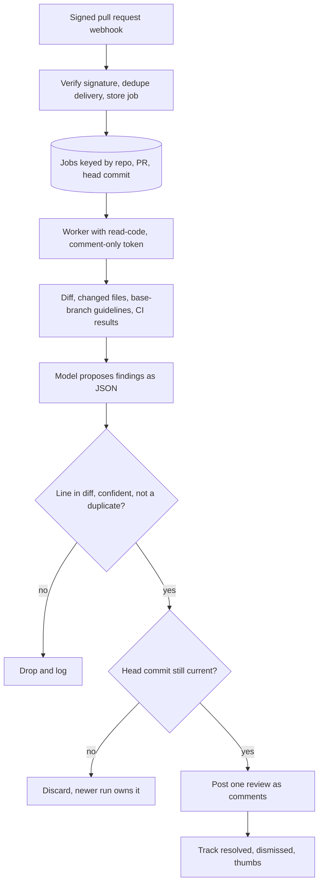

# run

```mermaid
flowchart TB
  hook[Signed pull request webhook] --> intake[Verify signature, dedupe delivery, store job]
  intake --> queue[(Jobs keyed by repo, PR, head commit)]
  queue --> worker[Worker with read-code, comment-only token]
  worker --> context[Diff, changed files, base-branch guidelines, CI results]
  context --> model[Model proposes findings as JSON]
  model --> check{Line in diff, confident, not a duplicate?}
  check -->|no| drop[Drop and log]
  check -->|yes| fresh{Head commit still current?}
  fresh -->|no| stale[Discard, newer run owns it]
  fresh -->|yes| post[Post one review as comments]
  post --> signal[Track resolved, dismissed, thumbs]
```
