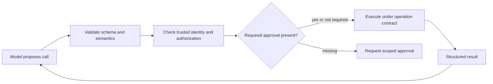

# call

```mermaid
flowchart LR
  model[Model proposes call] --> schema[Validate schema and semantics]
  schema --> auth[Check trusted identity and authorization]
  auth --> gate{Required approval present?}
  gate -->|yes or not required| exec[Execute under operation contract]
  gate -->|missing| wait[Request scoped approval]
  exec --> obs[Structured result]
  obs --> model
```
