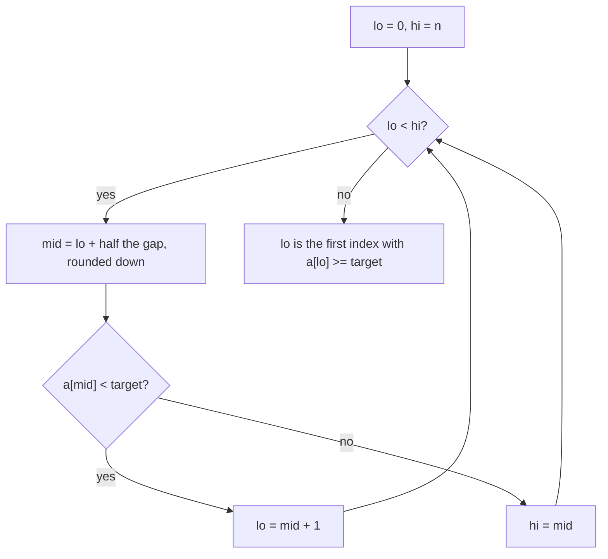

# bounds

```mermaid
flowchart TB
  start["lo = 0, hi = n"] --> test{"lo < hi?"}
  test -->|yes| mid["mid = lo + half the gap, rounded down"]
  mid --> cmp{"a[mid] < target?"}
  cmp -->|yes| right["lo = mid + 1"]
  cmp -->|no| left["hi = mid"]
  right --> test
  left --> test
  test -->|no| done["lo is the first index with a[lo] >= target"]
```
