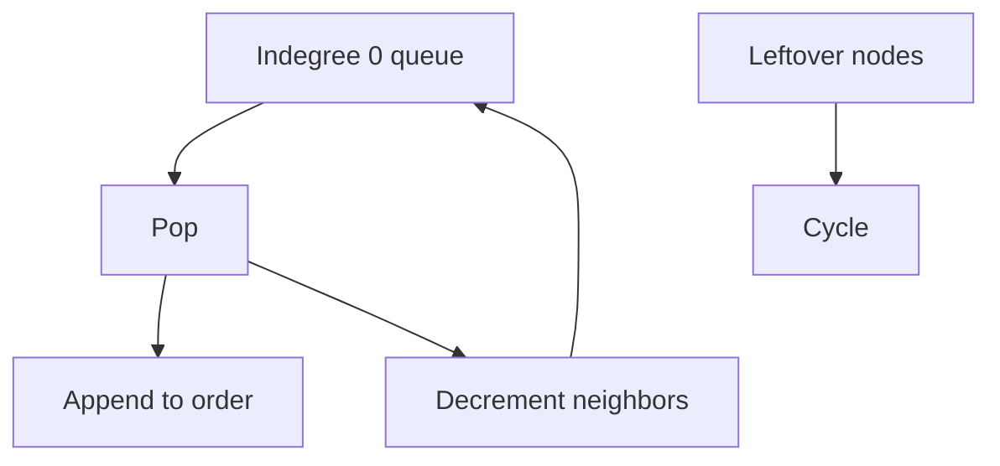

# kahn

```mermaid
flowchart TB
  zeros[Indegree 0 queue] --> node[Pop]
  node --> out[Append to order]
  node --> dec[Decrement neighbors]
  dec --> zeros
  leftover[Leftover nodes] --> cycle[Cycle]
```
