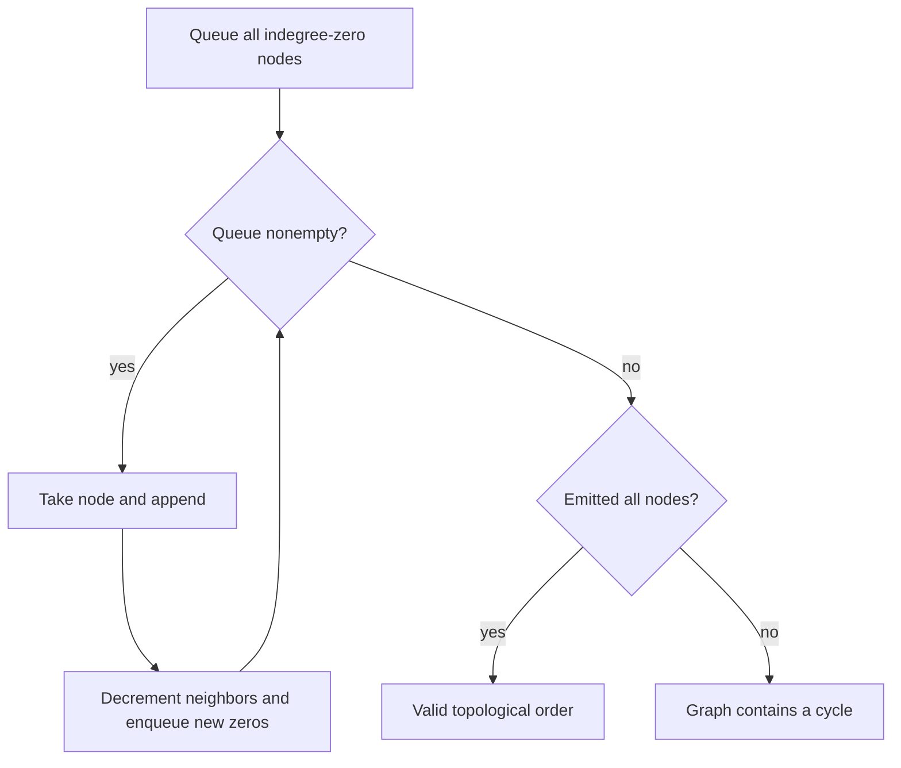

# kahn

```mermaid
flowchart TB
  zeros[Queue all indegree-zero nodes] --> more{Queue nonempty?}
  more -->|yes| out[Take node and append]
  out --> dec[Decrement neighbors and enqueue new zeros]
  dec --> more
  more -->|no| count{Emitted all nodes?}
  count -->|yes| done[Valid topological order]
  count -->|no| cycle[Graph contains a cycle]
```
