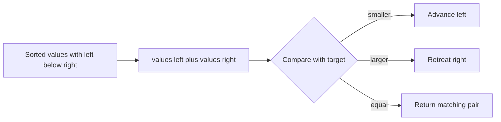

# squeeze

```mermaid
flowchart LR
  ends[Sorted values with left below right] --> sum[values left plus values right]
  sum --> cmp{Compare with target}
  cmp -->|smaller| moveL[Advance left]
  cmp -->|larger| moveR[Retreat right]
  cmp -->|equal| done[Return matching pair]
```
