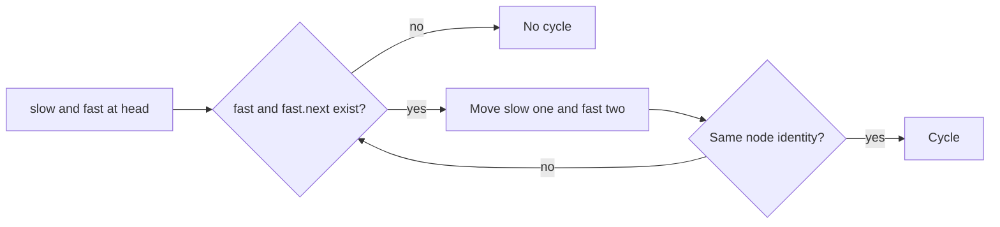

# meet

```mermaid
flowchart LR
  start[slow and fast at head] --> guard{fast and fast.next exist?}
  guard -->|no| no[No cycle]
  guard -->|yes| step[Move slow one and fast two]
  step --> same{Same node identity?}
  same -->|yes| yes[Cycle]
  same -->|no| guard
```
