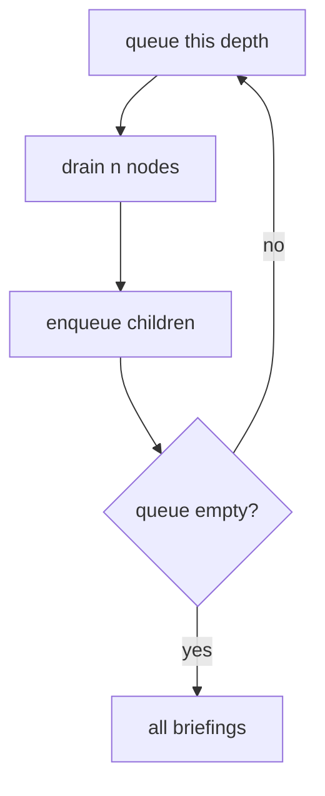

# layers

```mermaid
flowchart TB
  q[queue this depth] --> drain[drain n nodes]
  drain --> kids[enqueue children]
  kids --> more{queue empty?}
  more -->|no| q
  more -->|yes| done[all briefings]
```
