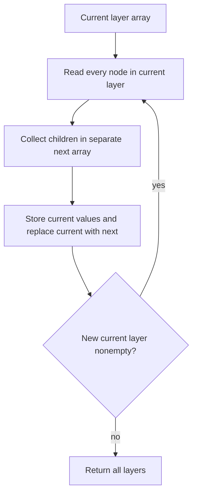

# layers

```mermaid
flowchart TB
  q[Current layer array] --> drain[Read every node in current layer]
  drain --> kids[Collect children in separate next array]
  kids --> out[Store current values and replace current with next]
  out --> more{New current layer nonempty?}
  more -->|yes| drain
  more -->|no| done[Return all layers]
```
