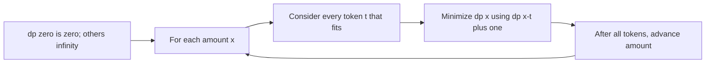

# table

```mermaid
flowchart LR
  seed[dp zero is zero; others infinity] --> x[For each amount x]
  x --> tok[Consider every token t that fits]
  tok --> take[Minimize dp x using dp x-t plus one]
  take --> next[After all tokens, advance amount]
  next --> x
```
