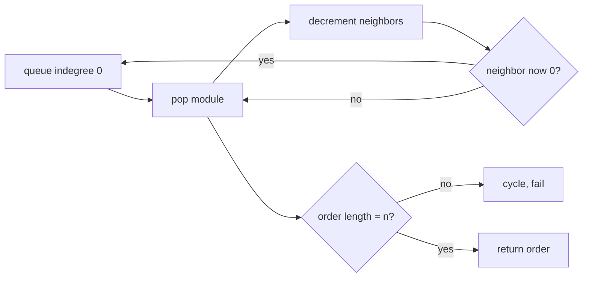

# peel

```mermaid
flowchart LR
  seed[queue indegree 0] --> peel[pop module]
  peel --> drop[decrement neighbors]
  drop --> zero{neighbor now 0?}
  zero -->|yes| seed
  zero -->|no| peel
  peel --> done{order length = n?}
  done -->|no| cycle[cycle, fail]
  done -->|yes| ok[return order]
```
