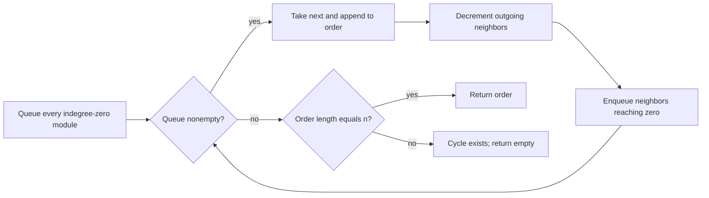

# peel

```mermaid
flowchart LR
  seed[Queue every indegree-zero module] --> more{Queue nonempty?}
  more -->|yes| peel[Take next and append to order]
  peel --> drop[Decrement outgoing neighbors]
  drop --> zero[Enqueue neighbors reaching zero]
  zero --> more
  more -->|no| done{Order length equals n?}
  done -->|yes| ok[Return order]
  done -->|no| cycle[Cycle exists; return empty]
```
