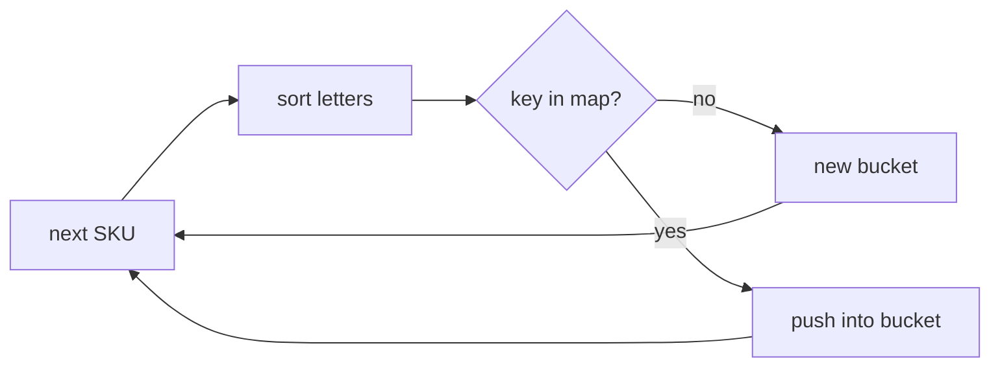

# bucket

```mermaid
flowchart LR
  tag[next SKU] --> key[sort letters]
  key --> hit{key in map?}
  hit -->|no| fresh[new bucket]
  hit -->|yes| push[push into bucket]
  fresh --> tag
  push --> tag
```
