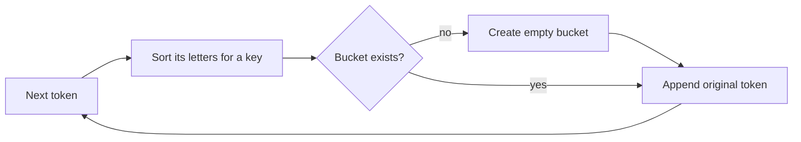

# bucket

```mermaid
flowchart LR
  tag[Next token] --> key[Sort its letters for a key]
  key --> hit{Bucket exists?}
  hit -->|no| fresh[Create empty bucket]
  fresh --> push[Append original token]
  hit -->|yes| push
  push --> tag
```
