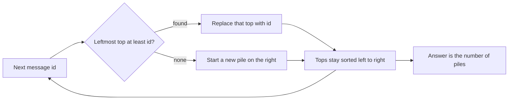

# piles

```mermaid
flowchart LR
  card[Next message id] --> search{Leftmost top at least id?}
  search -->|found| replace[Replace that top with id]
  search -->|none| append[Start a new pile on the right]
  replace --> sorted[Tops stay sorted left to right]
  append --> sorted
  sorted --> count[Answer is the number of piles]
  sorted --> card
```
