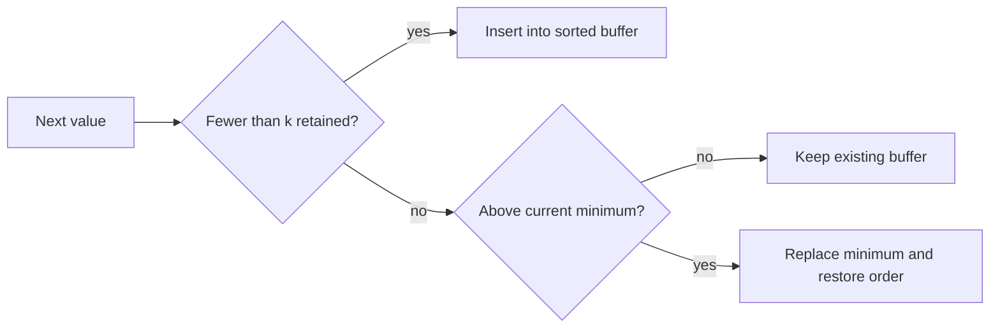

# buf

```mermaid
flowchart LR
  score[Next value] --> room{Fewer than k retained?}
  room -->|yes| add[Insert into sorted buffer]
  room -->|no| beat{Above current minimum?}
  beat -->|no| skip[Keep existing buffer]
  beat -->|yes| evict[Replace minimum and restore order]
```
