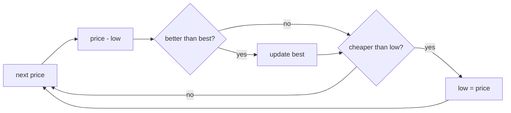

# low

```mermaid
flowchart LR
  p[next price] --> profit[price - low]
  profit --> keep{better than best?}
  keep -->|yes| best[update best]
  keep -->|no| cheap{cheaper than low?}
  best --> cheap
  cheap -->|yes| low[low = price]
  cheap -->|no| p
  low --> p
```
