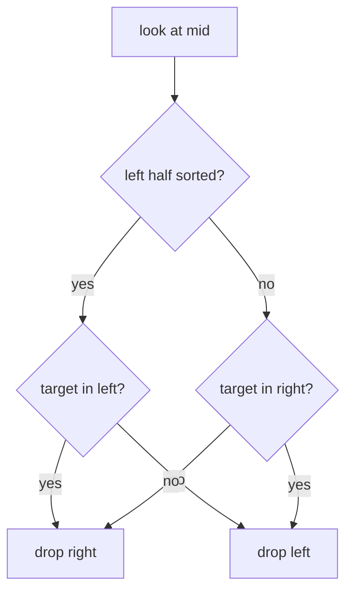

# half

```mermaid
flowchart TB
  mid[look at mid] --> left{left half sorted?}
  left -->|yes| inL{target in left?}
  left -->|no| inR{target in right?}
  inL -->|yes| dropR[drop right]
  inL -->|no| dropL[drop left]
  inR -->|yes| dropL
  inR -->|no| dropR
```
