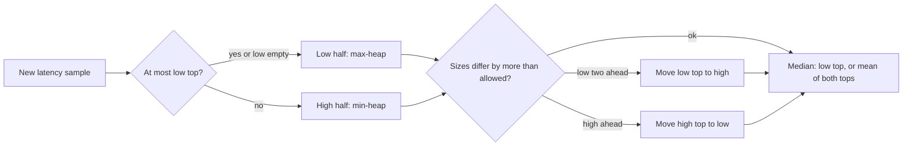

# halves

```mermaid
flowchart LR
  sample[New latency sample] --> route{At most low top?}
  route -->|yes or low empty| low[Low half: max-heap]
  route -->|no| high[High half: min-heap]
  low --> balance{Sizes differ by more than allowed?}
  high --> balance
  balance -->|low two ahead| tohigh[Move low top to high]
  balance -->|high ahead| tolow[Move high top to low]
  balance -->|ok| read[Median: low top, or mean of both tops]
  tohigh --> read
  tolow --> read
```
