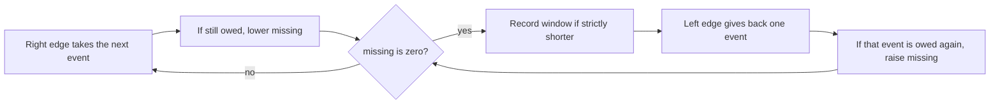

# cover

```mermaid
flowchart LR
  grow[Right edge takes the next event] --> debt[If still owed, lower missing]
  debt --> valid{missing is zero?}
  valid -->|no| grow
  valid -->|yes| record[Record window if strictly shorter]
  record --> shrink[Left edge gives back one event]
  shrink --> owe[If that event is owed again, raise missing]
  owe --> valid
```
