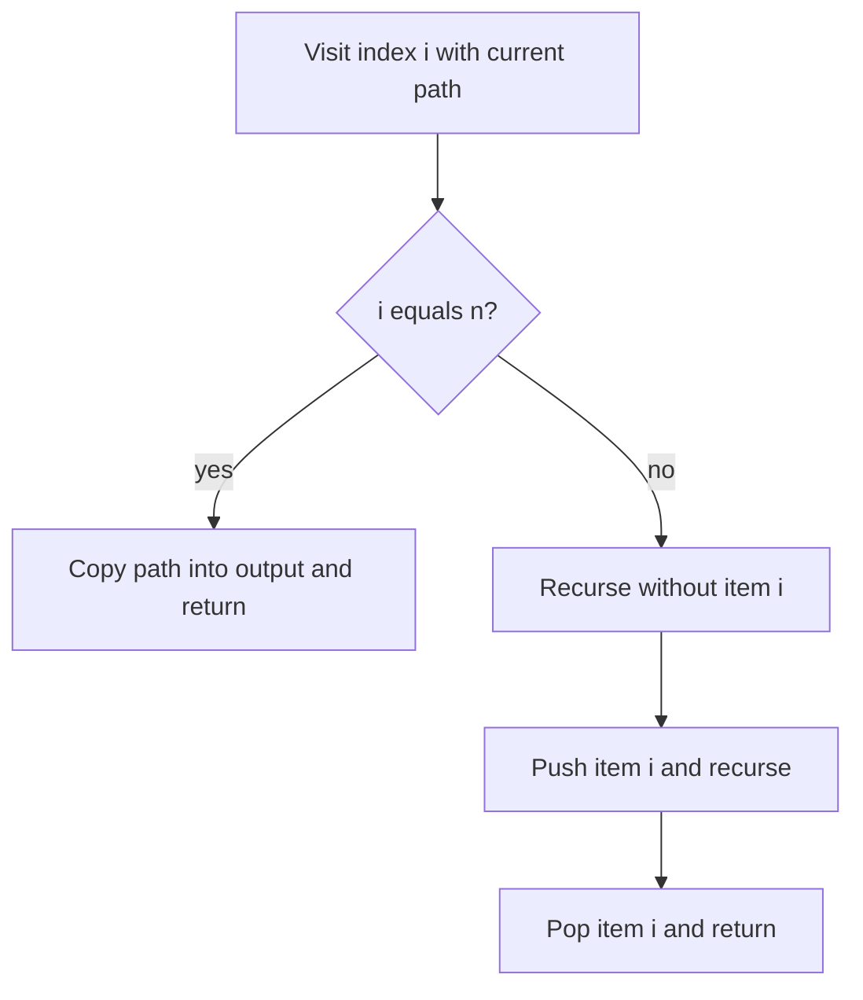

# branch

```mermaid
flowchart TB
  enter[Visit index i with current path] --> leaf{i equals n?}
  leaf -->|yes| copy[Copy path into output and return]
  leaf -->|no| skip[Recurse without item i]
  skip --> take[Push item i and recurse]
  take --> undo[Pop item i and return]
```
