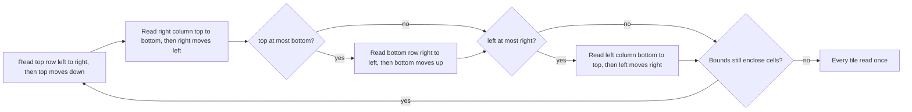

# bounds

```mermaid
flowchart LR
  topEdge[Read top row left to right, then top moves down] --> rightEdge[Read right column top to bottom, then right moves left]
  rightEdge --> guardRows{top at most bottom?}
  guardRows -->|yes| bottomEdge[Read bottom row right to left, then bottom moves up]
  guardRows -->|no| guardCols{left at most right?}
  bottomEdge --> guardCols
  guardCols -->|yes| leftEdge[Read left column bottom to top, then left moves right]
  guardCols -->|no| more{Bounds still enclose cells?}
  leftEdge --> more
  more -->|yes| topEdge
  more -->|no| done[Every tile read once]
```
