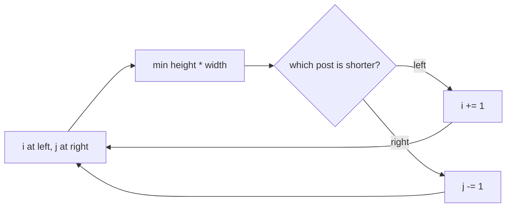

# span

```mermaid
flowchart LR
  ends[i at left, j at right] --> area[min height * width]
  area --> short{which post is shorter?}
  short -->|left| iIn[i += 1]
  short -->|right| jIn[j -= 1]
  iIn --> ends
  jIn --> ends
```
