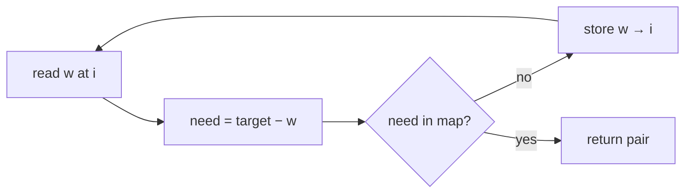

# Walk the cart

```mermaid
flowchart LR
  scan["read w at i"] --> need["need = target − w"]
  need --> hit{"need in map?"}
  hit -->|no| miss["store w → i"]
  miss --> scan
  hit -->|yes| done["return pair"]
```
