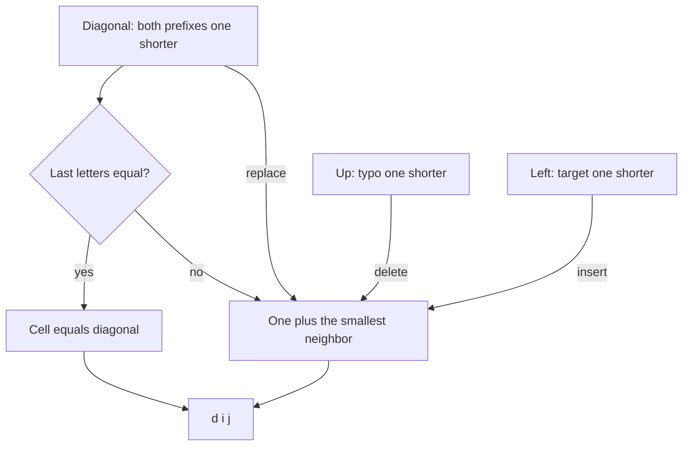

# cell

```mermaid
flowchart TB
  diag[Diagonal: both prefixes one shorter] --> same{Last letters equal?}
  same -->|yes| copy[Cell equals diagonal]
  same -->|no| pick[One plus the smallest neighbor]
  diag -->|replace| pick
  up[Up: typo one shorter] -->|delete| pick
  left[Left: target one shorter] -->|insert| pick
  copy --> cell[d i j]
  pick --> cell
```
