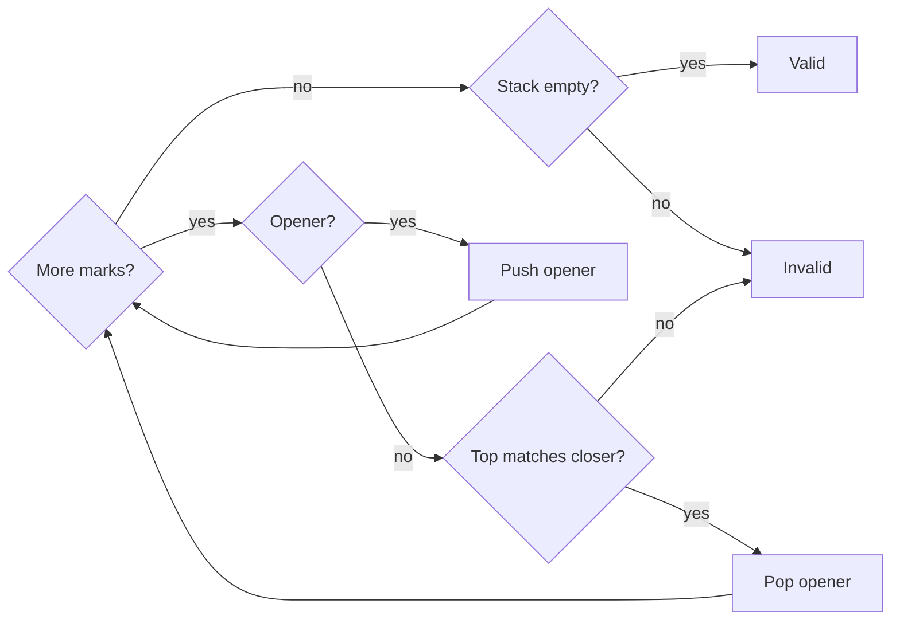

# stack

```mermaid
flowchart LR
  more{More marks?} -->|no| empty{Stack empty?}
  empty -->|yes| good[Valid]
  empty -->|no| bad[Invalid]
  more -->|yes| kind{Opener?}
  kind -->|yes| push[Push opener]
  push --> more
  kind -->|no| match{Top matches closer?}
  match -->|no| bad
  match -->|yes| pop[Pop opener]
  pop --> more
```
