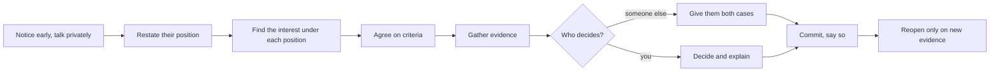

# The disagreement path

```mermaid
flowchart LR
  notice[Notice early, talk privately] --> restate[Restate their position]
  restate --> interest[Find the interest under each position]
  interest --> criteria[Agree on criteria]
  criteria --> evidence[Gather evidence]
  evidence --> decide{Who decides?}
  decide -->|you| commitYou[Decide and explain]
  decide -->|someone else| brief[Give them both cases]
  brief --> commit[Commit, say so]
  commitYou --> commit
  commit --> reopen[Reopen only on new evidence]
```
