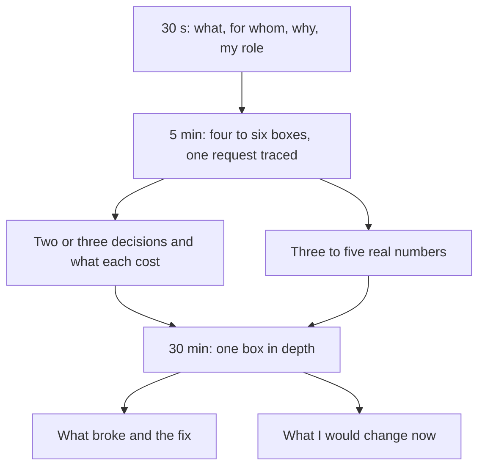

# Three zoom levels

```mermaid
flowchart TB
  headline[30 s: what, for whom, why, my role] --> walk[5 min: four to six boxes, one request traced]
  walk --> decisions[Two or three decisions and what each cost]
  walk --> numbers[Three to five real numbers]
  decisions --> deep[30 min: one box in depth]
  numbers --> deep
  deep --> failure[What broke and the fix]
  deep --> change[What I would change now]
```
