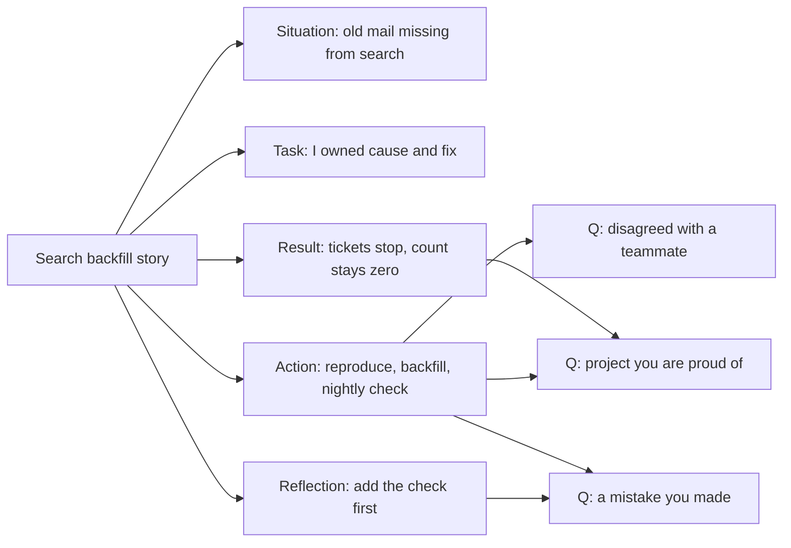

# One story, several questions

```mermaid
flowchart LR
  story[Search backfill story] --> sit[Situation: old mail missing from search]
  story --> task[Task: I owned cause and fix]
  story --> act[Action: reproduce, backfill, nightly check]
  story --> res[Result: tickets stop, count stays zero]
  story --> refl[Reflection: add the check first]
  act --> qproud[Q: project you are proud of]
  res --> qproud
  act --> qconflict[Q: disagreed with a teammate]
  refl --> qmistake[Q: a mistake you made]
  act --> qmistake
```
