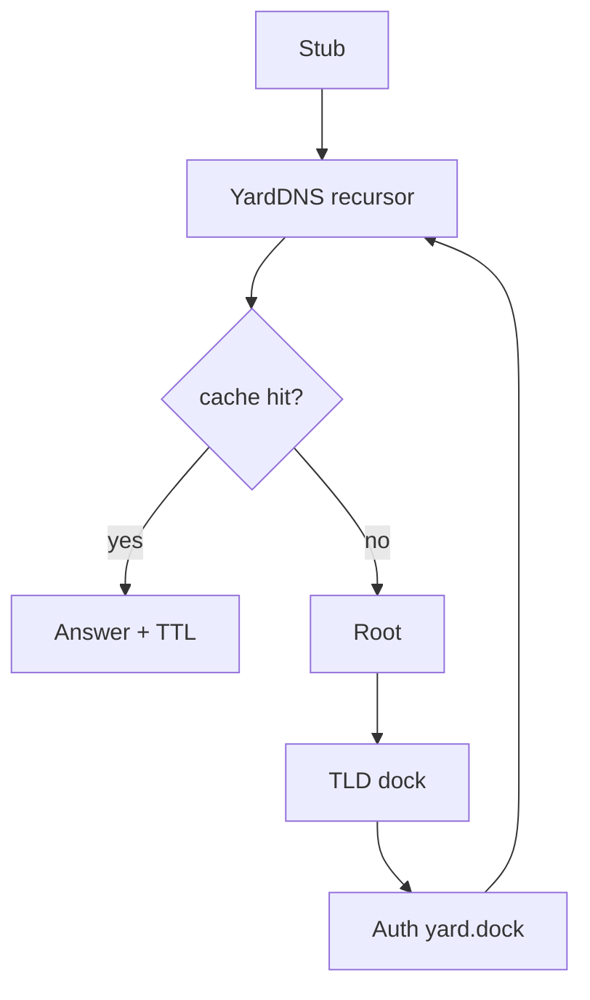

# lookup

```mermaid
flowchart TB
  stub[Stub] --> rec[YardDNS recursor]
  rec --> cache{cache hit?}
  cache -->|yes| ans[Answer + TTL]
  cache -->|no| root[Root]
  root --> tld[TLD dock]
  tld --> auth[Auth yard.dock]
  auth --> rec
```
