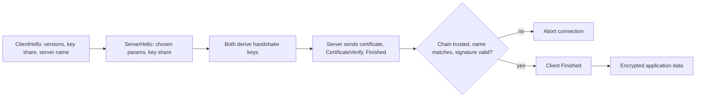

# handshake

```mermaid
flowchart LR
  hello[ClientHello: versions, key share, server name] --> shello[ServerHello: chosen params, key share]
  shello --> keys[Both derive handshake keys]
  keys --> cert[Server sends certificate, CertificateVerify, Finished]
  cert --> verify{Chain trusted, name matches, signature valid?}
  verify -->|no| abort[Abort connection]
  verify -->|yes| fin[Client Finished]
  fin --> data[Encrypted application data]
```
