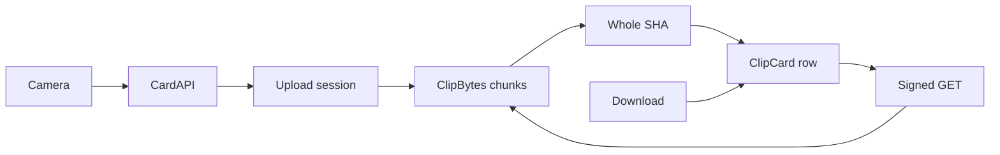

# put

```mermaid
flowchart LR
  cam[Camera] --> card[CardAPI]
  card --> sess[Upload session]
  sess --> bytes[ClipBytes chunks]
  bytes --> sha[Whole SHA]
  sha --> meta[ClipCard row]
  get[Download] --> meta
  meta --> sign[Signed GET]
  sign --> bytes
```
