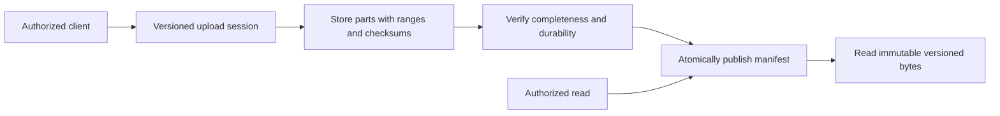

# put

```mermaid
flowchart LR
  client[Authorized client] --> sess[Versioned upload session]
  sess --> parts[Store parts with ranges and checksums]
  parts --> verify[Verify completeness and durability]
  verify --> meta[Atomically publish manifest]
  get[Authorized read] --> meta
  meta --> bytes[Read immutable versioned bytes]
```
