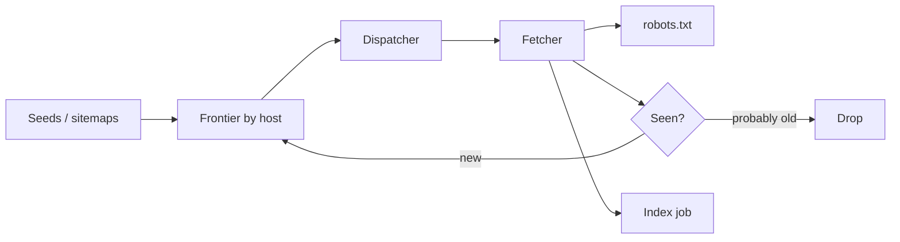

# crawl

```mermaid
flowchart LR
  seed[Seeds / sitemaps] --> front[Frontier by host]
  front --> disp[Dispatcher]
  disp --> fetch[Fetcher]
  fetch --> robots[robots.txt]
  fetch --> seen{Seen?}
  seen -->|new| front
  seen -->|probably old| drop[Drop]
  fetch --> idx[Index job]
```
