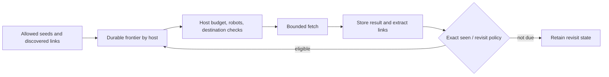

# crawl

```mermaid
flowchart LR
  seed[Allowed seeds and discovered links] --> front[Durable frontier by host]
  front --> gate[Host budget, robots, destination checks]
  gate --> fetch[Bounded fetch]
  fetch --> result[Store result and extract links]
  result --> seen{Exact seen / revisit policy}
  seen -->|eligible| front
  seen -->|not due| later[Retain revisit state]
```
