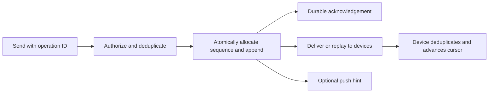

# delivery

```mermaid
flowchart LR
  send[Send with operation ID] --> api[Authorize and deduplicate]
  api --> log[Atomically allocate sequence and append]
  log --> ack[Durable acknowledgement]
  log --> fan[Deliver or replay to devices]
  fan --> recv[Device deduplicates and advances cursor]
  log --> push[Optional push hint]
```
