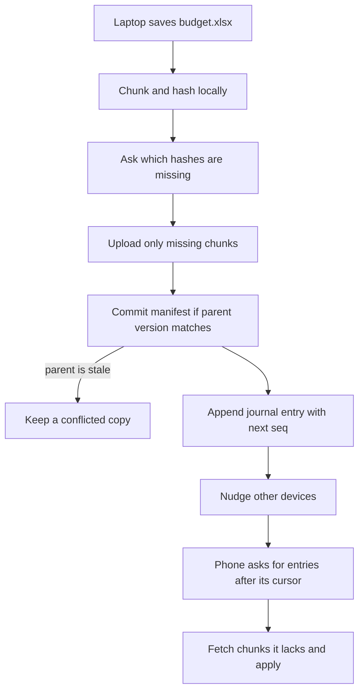

# sync

```mermaid
flowchart TB
  save[Laptop saves budget.xlsx] --> chunk[Chunk and hash locally]
  chunk --> ask[Ask which hashes are missing]
  ask --> up[Upload only missing chunks]
  up --> cas[Commit manifest if parent version matches]
  cas -->|parent is stale| conflict[Keep a conflicted copy]
  cas --> journal[Append journal entry with next seq]
  journal --> nudge[Nudge other devices]
  nudge --> pull[Phone asks for entries after its cursor]
  pull --> fetch[Fetch chunks it lacks and apply]
```
